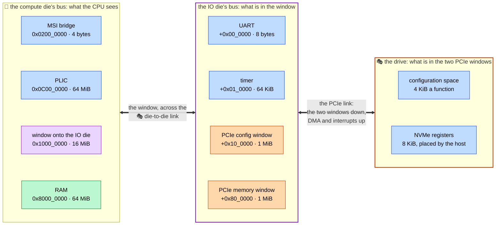
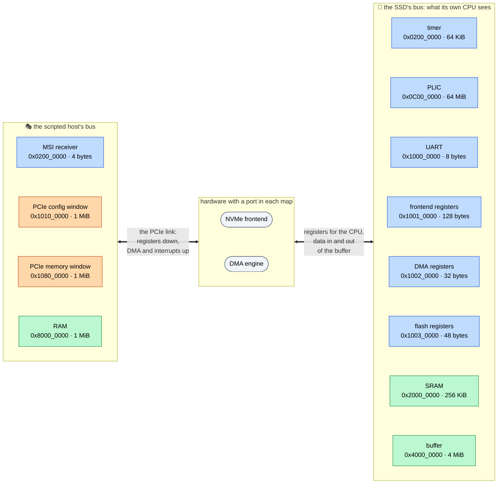

# The address map

🎓 An *address map* says which device answers at which address. It is all a CPU has to go on: firmware prints a character by writing a byte to a number, and the map is what makes that number the UART.

socpuppet has no file where the map is written down. It falls out of a board's Python description: each `bus.map(device.socket, base=...)` puts one device on one bus, and a link or a window carries a range of one bus onto another. The devicetree that firmware is built against is generated from the same description, so the firmware and the model cannot disagree about where the UART is.

Two things follow, and the rest of this page is pictures of them.

- **There is more than one map.** A map belongs to whoever starts the access, which is called a *bus master*. The host's CPU has one map and the SSD's CPU has another, with different things at the same numbers.
- **A map can have a window in it.** A window is a range of one bus that leads onto another bus, over a link. What is behind it has a map of its own.

⚠️ This page is written by hand, and the board descriptions are what is true. [See it yourself](#see-it-yourself) prints the maps from them.

## The host

`socpuppet.boards.host` is a 64-bit RISC-V computer split over two dies, and the Zephyr board `socpuppet_host`. With `host(drive_blocks=...)` it has a 🎭 stand-in NVMe drive on a PCIe link as well, which is the board drawn here.



The first two columns are a bus each, lowest address at the top. Green is memory and blue is a device's registers. The purple block is a window, and the purple box is the bus behind it. The two orange blocks are windows too, onto the orange box. The drawing is not to scale: the PLIC's 64 MiB and the UART's 8 bytes come out the same size, which flatters the UART.

As one flat list, which is how the CPU and its firmware see it:

| Address | Size | What answers | Die | Its page |
|---|---|---|---|---|
| `0x0200_0000` | 4 bytes | The MSI bridge, where the drive's interrupt messages are sent. Only with a drive. | compute | [MSI-to-PLIC bridge](models/msi-plic-bridge.md) |
| `0x0C00_0000` | 64 MiB | The PLIC, the interrupt controller. | compute | [PLIC](models/plic.md) |
| `0x1000_0000` | 8 bytes | The UART, which is the console. | IO | [UART](models/ns16550.md) |
| `0x1001_0000` | 64 KiB | The machine timer. | IO | [Machine timer](models/machine-timer.md) |
| `0x1010_0000` | 1 MiB | The PCIe configuration window. Only with a drive. | IO | [PCIe root complex](models/pcie-root-complex.md) |
| `0x1080_0000` | 1 MiB | The PCIe memory window, with the drive's registers somewhere in it. Only with a drive. | IO | [PCIe root complex](models/pcie-root-complex.md) |
| `0x8000_0000` | 64 MiB | The RAM. The CPU starts executing at its first address. | compute | [Memory](models/memory.md) |

The constants are at the top of `python/socpuppet/boards/host.py`.

- 💡 **A window translates.** A [router](models/router.md) hands a target the offset from the start of the range that matched. So the IO die's bus counts from zero: the UART is at `0` there and the timer at `0x1_0000`, and the CPU finds them at `0x1000_0000` and `0x1001_0000`. Firmware sees one flat map and cannot tell where the die boundary is, which is the point: the split can change without the firmware changing.
- 🎓 **The two PCIe windows are two kinds of address.** The configuration window is how a host asks what is on the link. Every function a bus could hold has 4 KiB of it, laid out by bus, device and function number, so 1 MiB is one whole bus. The drive's NVMe registers are something else: 8 KiB that the host places wherever it likes in the memory window, by writing an address into the drive's *base address register* (BAR). 🎭 The scripted host puts them at the start, `0x1080_0000`.
- **What comes back up sees the same map.** A drive reads and writes the host's memory by itself, which is DMA, and it interrupts by writing a small message to an address the host chose. Both come up the PCIe link, back across the die-to-die link, and onto the compute die's bus through an input of their own. From there the RAM is at `0x8000_0000` for the data, and the MSI bridge at `0x0200_0000` for the message.
- **Everywhere else there is nothing.** An access to an address that no range covers gets an address error. A script that makes one stops with `BusError`, naming the address.
- 🎓 **The numbers are borrowed.** RAM at `0x8000_0000`, the PLIC at `0x0C00_0000` and a UART at `0x1000_0000` are where QEMU's RISC-V `virt` machine has them, so they are the addresses a learner is most likely to have met already. The PLIC's 64 MiB is what the RISC-V specification lays its registers out over, most of it empty.
- ⚠️ **A devicetree names the timer by its registers**, as `timer@1001bff8`. That is `mtime`, at offset `0xBFF8` in the timer's 64 KiB, and `mtimecmp` is at `0x4000`.

## The SSD

`socpuppet.boards.ssd` is an NVMe drive built the way a real one is, and the Zephyr board `socpuppet_ssd`. An SSD is a computer of its own, with a 32-bit CPU and a map of its own. Its host sees none of that map, and its CPU sees none of the host's.



The left column is the host's map and the right one is the SSD's. Nothing in one is reachable from the other. What joins them is the two blocks in the middle, which have a port on each side.

| Address | Size | What answers | Its page |
|---|---|---|---|
| `0x0200_0000` | 64 KiB | The machine timer. | [Machine timer](models/machine-timer.md) |
| `0x0C00_0000` | 64 MiB | The PLIC. The frontend, the DMA engine and the flash controller are its sources 1, 2 and 3. | [PLIC](models/plic.md) |
| `0x1000_0000` | 8 bytes | The UART, the firmware's console. | [UART](models/ns16550.md) |
| `0x1001_0000` | 128 bytes | The NVMe frontend's registers for its CPU. | [NVMe frontend](models/nvme-frontend.md) |
| `0x1002_0000` | 32 bytes | The DMA engine's registers. | [DMA engine](models/dma-engine.md) |
| `0x1003_0000` | 48 bytes | The flash controller's registers. | [Flash controller](models/flash-controller.md) |
| `0x2000_0000` | 256 KiB | The SRAM, which the firmware is loaded into and runs from. The CPU starts executing at its first address. | [Memory](models/memory.md) |
| `0x4000_0000` | 4 MiB | The buffer, which data passes through on its way between the host and the NAND. | [Memory](models/memory.md) |

The constants are at the top of `python/socpuppet/boards/ssd.py`.

- ⚠️ **The same number is two things.** `0x1001_0000` is the timer to the host's CPU and the NVMe frontend to the SSD's. Neither is wrong. An address means nothing until you say whose map it is in, and with two firmware images in one simulation that is the first question to ask of any address in a log.
- **The frontend has two register blocks.** The host's is the 8 KiB every NVMe drive shows, which reaches the host through the PCIe endpoint and lands wherever the host puts it in its memory window. The CPU's is the 128 bytes at `0x1001_0000`, which no host ever sees.
- 🎓 **The DMA engine's registers hold addresses from both maps.** `HOST_ADDRESS` is 64 bits, in two registers, and is an address in the host's map. `LOCAL_ADDRESS` is 32 bits and is an address in this one, which in practice is somewhere in the buffer. The firmware reads the first out of an NVMe command and chooses the second.
- **The way up is all of the host's map.** The frontend and the DMA engine reach the host through the endpoint at the host's own addresses, from address 0 up for half of what 64 bits can say, which is more than any host has. The CPU has no way up at all: firmware that wants host memory asks the DMA engine.
- ⚠️ **The SRAM has to stay below the buffer.** A devicetree tells firmware which memory is its own (`zephyr,sram`), and of two memories the generator names the one at the lower address.
- 🎭 **With a script for its firmware the SSD has no CPU**, and no timer, PLIC, UART or SRAM either. The three register blocks and the buffer stay where they are.

## 🚧 The IO manager

The third board, `socpuppet.boards.io_manager`, is milestone M5 and is not built yet. What is decided is in [the plan](plan.md): the IO die gets a small CPU of its own, with a map that mirrors the SSD's, and the die-to-die link's register block at `0x1001_0000` where the SSD has its frontend. Its compute die will reach the IO die through a window that does not translate, so that both dies use the same addresses for the same things. That is the opposite of the host board above, whose window counts from zero.

## See it yourself

The map a description gives is printed as a devicetree, with nothing simulated:

```sh
socpuppet devicetree python/socpuppet/boards/host.py
socpuppet devicetree python/socpuppet/boards/ssd.py --via ssd.cpu.socket
```

💡 The second command has to say whose map it wants, because that platform has two bus masters, and `--via` names the port the accesses start from. [Boot your own firmware](boot-your-firmware.md) has how to copy a board and move things around in it.
