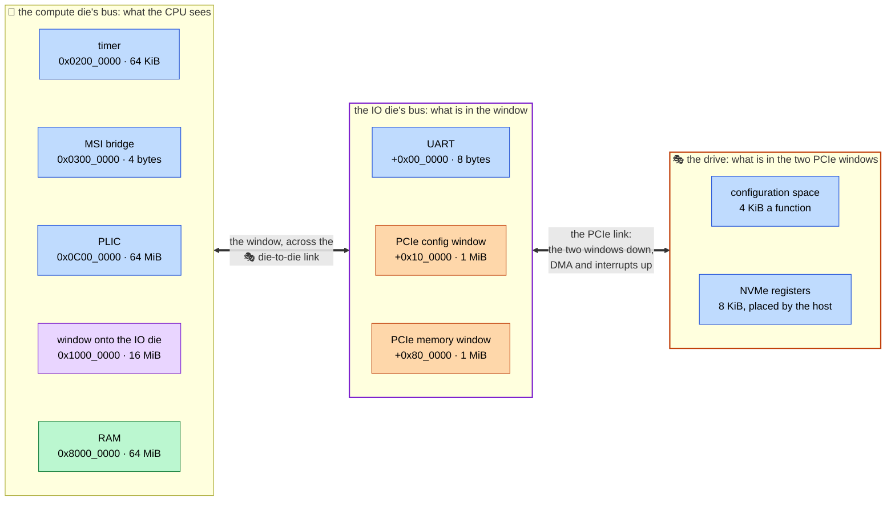

# The address map

🎓 An *address map* says which device answers at which address. It is all a CPU has to go on: firmware prints a character by writing a byte to a number, and the map is what makes that number the UART.

socpuppet has no file where the map is written down. It falls out of a board's Python description: each `bus.map(device.socket, base=...)` puts one device on one bus, and a link or a window carries a range of one bus onto another. The devicetree that firmware is built against is generated from the same description, so the firmware and the model cannot disagree about where the UART is.

Two things follow, and the rest of this page is pictures of them.

- **There is more than one map.** A map belongs to whoever starts the access, which is called a *bus master*. The host's CPU has one map and the SSD's CPU has another, with different things at the same numbers.
- **A map can have a window in it.** A window is a range of one bus that leads onto another bus, over a link. What is behind it has a map of its own.

💡 **The tables on this page are generated.** `tools/address_map_docs.py` writes each one from the board's description, between two marker comments, and lint fails if a table is not what the board gives. So a table here cannot drift from its board. The drawings and the words around the tables are written by hand. [See it yourself](#see-it-yourself) prints the same maps at a terminal.

## How to read a table

Every table has the same five columns.

- **Address** and **Size** are where the thing is in this bus master's map, and how many bytes of it answer there.
- **What answers** is a port, by its path in the description: `io.uart.socket` is the port `socket` of the component `uart` in the group `io`. It is the same name `--via` takes.
- **Its model** is the page for the kind of thing it is.
- **Through** is the windows an access crosses on the way, nearest first. 🎓 A *window* is a range of one bus that leads on to another bus. `compute.bus` from `0x1000_0000` is a window of `compute.bus` that starts at that address, and it *translates*: the bus behind it counts its own addresses from zero. A window marked "same addresses" starts at address 0 and does not. A cell with nothing in it is for something on the master's own bus.

An interrupt table says which line is which number to the firmware. 🎓 The **Controller** is what takes the line, an interrupt controller or the CPU itself. The **Number** is all the firmware knows the device by, and the **Line** is the port that drives it.

## The host

`socpuppet.boards.host` is a 64-bit RISC-V computer split over two dies, and the Zephyr board `socpuppet_host`. With `host(drive_blocks=...)` it has a 🎭 stand-in NVMe drive on a PCIe link as well, which is the board drawn here.



The first two columns are a bus each, lowest address at the top. Green is memory and blue is a device's registers. The purple block is a window, and the purple box is the bus behind it. The two orange blocks are windows too, onto the orange box. The drawing is not to scale: the PLIC's 64 MiB and the UART's 8 bytes come out the same size, which flatters the UART.

As one flat list, which is how the CPU (`compute.cpu.socket`) and its firmware see the board with no drive:

<!-- address-map:host start -->

| Address | Size | What answers | Its model | Through |
| --- | --- | --- | --- | --- |
| `0x0200_0000` | 64 KiB | `compute.timer.socket` | [Machine timer](models/machine-timer.md) | |
| `0x0C00_0000` | 64 MiB | `compute.plic.socket` | [Interrupt controller (PLIC)](models/plic.md) | |
| `0x1000_0000` | 8 bytes | `io.uart.socket` | [UART (16550)](models/ns16550.md) | `compute.bus` from `0x1000_0000` |
| `0x8000_0000` | 64 MiB | `compute.ram.socket` | [Memory](models/memory.md) | |

<!-- address-map:host end -->

With a drive, three more things answer:

<!-- address-map:host-drive start -->

| Address | Size | What answers | Its model | Through |
| --- | --- | --- | --- | --- |
| `0x0300_0000` | 4 bytes | `compute.msi.socket` | [MSI-to-PLIC bridge](models/msi-plic-bridge.md) | |
| `0x1010_0000` | 1 MiB | `io.rc.ecam` | [PCIe root complex](models/pcie-root-complex.md) | `compute.bus` from `0x1000_0000` |
| `0x1080_0000` | 1 MiB | `io.rc.mmio` | [PCIe root complex](models/pcie-root-complex.md) | `compute.bus` from `0x1000_0000` |

<!-- address-map:host-drive end -->

The interrupt lines of the board with no drive:

<!-- interrupts:host start -->

| Controller | Number | Line |
| --- | --- | --- |
| `compute.cpu` | 7 | `compute.timer.irq` |
| `compute.cpu` | 11 | `compute.plic.irq` |

<!-- interrupts:host end -->

And a drive adds one line for each of its interrupt vectors:

<!-- interrupts:host-drive start -->

| Controller | Number | Line |
| --- | --- | --- |
| `compute.plic` | 1 | `compute.msi.irq0` |
| `compute.plic` | 2 | `compute.msi.irq1` |

<!-- interrupts:host-drive end -->

The constants are at the top of `python/socpuppet/boards/host.py`.

- **What they are for.** `io.uart` is the console. `compute.ram` is where firmware is loaded, and the CPU starts executing at its first address. `compute.msi` is where the drive's interrupt messages are sent. `io.rc.ecam` is the PCIe configuration window, and `io.rc.mmio` the PCIe memory window, with the drive's registers somewhere in it.
- 💡 **A window translates.** A [router](models/router.md) hands a target the offset from the start of the range that matched. So the IO die's bus counts from zero: the UART is at `0` there and the PCIe configuration window at `0x10_0000`, and the CPU finds them at `0x1000_0000` and `0x1010_0000`. Firmware sees one flat map and cannot tell where the die boundary is, which is the point: the split can change without the firmware changing.
- 🎓 **The two PCIe windows are two kinds of address.** The configuration window is how a host asks what is on the link. Every function a bus could hold has 4 KiB of it, laid out by bus, device and function number, so 1 MiB is one whole bus. The drive's NVMe registers are something else: 8 KiB that the host places wherever it likes in the memory window, by writing an address into the drive's *base address register* (BAR). 🎭 The scripted host puts them at the start, `0x1080_0000`.
- **What comes back up sees the same map.** A drive reads and writes the host's memory by itself, which is DMA, and it interrupts by writing a small message to an address the host chose. Both come up the PCIe link, back across the die-to-die link, and onto the compute die's bus through an input of their own. From there the RAM is at `0x8000_0000` for the data, and the MSI bridge at `0x0300_0000` for the message.
- **Everywhere else there is nothing.** An access to an address that no range covers gets an address error. A script that makes one stops with `BusError`, naming the address.
- 🎓 **The numbers are borrowed.** RAM at `0x8000_0000`, the timer at `0x0200_0000`, the PLIC at `0x0C00_0000` and a UART at `0x1000_0000` are where QEMU's RISC-V `virt` machine has them, so they are the addresses a learner is most likely to have met already. The PLIC's 64 MiB is what the RISC-V specification lays its registers out over, most of it empty.
- ⚠️ **A devicetree names the timer by its registers**, as `timer@200bff8`. That is `mtime`, at offset `0xBFF8` in the timer's 64 KiB, and `mtimecmp` is at `0x4000`.
- 💡 **The timer is on the CPU's die**, and so is everything else with an interrupt line to the CPU. A die-to-die link carries transactions and messages, and has no wire for a line to go down. The UART is on the other die and has no line at all: Zephyr's console polls it.

## The SSD

`socpuppet.boards.ssd` is an NVMe drive built the way a real one is, and the Zephyr board `socpuppet_ssd`. An SSD is a computer of its own, with a 32-bit CPU and a map of its own. Its host sees none of that map, and its CPU sees none of the host's.


The left column is the host's map and the right one is the SSD's. Nothing in one is reachable from the other. What joins them is the two blocks in the middle, which have a port on each side.

What the SSD's own CPU sees (`ssd.cpu.socket`):

<!-- address-map:ssd start -->

| Address | Size | What answers | Its model | Through |
| --- | --- | --- | --- | --- |
| `0x0200_0000` | 64 KiB | `ssd.timer.socket` | [Machine timer](models/machine-timer.md) | |
| `0x0C00_0000` | 64 MiB | `ssd.plic.socket` | [Interrupt controller (PLIC)](models/plic.md) | |
| `0x1000_0000` | 8 bytes | `ssd.uart.socket` | [UART (16550)](models/ns16550.md) | |
| `0x1001_0000` | 128 bytes | `ssd.frontend.cpu` | [NVMe frontend](models/nvme-frontend.md) | |
| `0x1002_0000` | 32 bytes | `ssd.dma.cpu` | [DMA engine](models/dma-engine.md) | |
| `0x1003_0000` | 48 bytes | `ssd.flash.cpu` | [Flash controller](models/flash-controller.md) | |
| `0x2000_0000` | 256 KiB | `ssd.sram.socket` | [Memory](models/memory.md) | |
| `0x4000_0000` | 4 MiB | `ssd.buffer.socket` | [Memory](models/memory.md) | |

<!-- address-map:ssd end -->

Its interrupt lines:

<!-- interrupts:ssd start -->

| Controller | Number | Line |
| --- | --- | --- |
| `ssd.cpu` | 7 | `ssd.timer.irq` |
| `ssd.cpu` | 11 | `ssd.plic.irq` |
| `ssd.plic` | 1 | `ssd.frontend.cpu_irq` |
| `ssd.plic` | 2 | `ssd.dma.irq` |
| `ssd.plic` | 3 | `ssd.flash.irq` |

<!-- interrupts:ssd end -->

And for comparison, what 🎭 the scripted host in front of it sees (`host.cpu.socket`):

<!-- address-map:ssd-host start -->

| Address | Size | What answers | Its model | Through |
| --- | --- | --- | --- | --- |
| `0x0300_0000` | 4 bytes | `host.msi.socket` | [🎭 MSI receiver](models/msi-receiver.md) | |
| `0x1010_0000` | 1 MiB | `host.rc.ecam` | [PCIe root complex](models/pcie-root-complex.md) | |
| `0x1080_0000` | 1 MiB | `host.rc.mmio` | [PCIe root complex](models/pcie-root-complex.md) | |
| `0x8000_0000` | 1 MiB | `host.ram.socket` | [Memory](models/memory.md) | |

<!-- address-map:ssd-host end -->

The SSD's constants are at the top of `python/socpuppet/boards/ssd.py`, the ones every board's CPU shares in `boards/cpu_kit.py`, and the scripted host's in `boards/scripted_host.py`.

- **What they are for.** `ssd.uart` is the firmware's console. `ssd.sram` is what the firmware is loaded into and runs from, and the CPU starts executing at its first address. `ssd.buffer` is what data passes through on its way between the host and the NAND. The three register blocks are how the firmware works the NVMe frontend, the DMA engine and the flash controller.
- ⚠️ **The same number is two things.** `0x1000_0000` is the host's console to the host's CPU and the SSD's console to the SSD's, and `0x8000_0000` is the host's RAM to one and nothing at all to the other. Neither is wrong. An address means nothing until you say whose map it is in, and with two firmware images in one simulation that is the first question to ask of any address in a log.
- **The frontend has two register blocks.** The host's is the 8 KiB every NVMe drive shows, which reaches the host through the PCIe endpoint and lands wherever the host puts it in its memory window. The CPU's is the 128 bytes at `0x1001_0000`, which no host ever sees.
- 🎓 **The DMA engine's registers hold addresses from both maps.** `HOST_ADDRESS` is 64 bits, in two registers, and is an address in the host's map. `LOCAL_ADDRESS` is 32 bits and is an address in this one, which in practice is somewhere in the buffer. The firmware reads the first out of an NVMe command and chooses the second.
- **The way up is all of the host's map.** The frontend and the DMA engine reach the host through the endpoint at the host's own addresses, from address 0 up for half of what 64 bits can say, which is more than any host has. The CPU has no way up at all: firmware that wants host memory asks the DMA engine.
- ⚠️ **The SRAM has to stay below the buffer.** A devicetree tells firmware which memory is its own (`zephyr,sram`), and of two memories the generator names the one at the lower address.
- 🎭 **With a script for its firmware the SSD has no CPU**, and no timer, PLIC, UART or SRAM either. The three register blocks and the buffer stay where they are.

## The host with the SSD

`host(drive_blocks=..., drive=add_ssd)` is the host above with the SSD above where 🎭 the stand-in drive was. It is two computers in one simulation, and it adds no map of its own.

- **The host's CPU (`compute.cpu.socket`) sees exactly what it sees with the stand-in drive**: the two tables under [The host](#the-host). Both drives say the same of themselves on the PCIe link, so firmware built for the host with a drive runs with either.
- **The SSD's CPU (`ssd.cpu.socket`) sees exactly what it sees on its own board**: the first table under [The SSD](#the-ssd). Firmware built for `socpuppet_ssd` runs here unchanged.
- ⚠️ **So every question about this board starts with "whose?"** `platform.load_elf`, `platform.peek32`, `platform.devicetree` and `socpuppet address-map` all take the CPU whose view you mean, as `via=` or `--via`.

What is new is the interrupt lines side by side. There are two interrupt controllers, one for each CPU, and source 1 is a different line on each:

<!-- interrupts:host-ssd start -->

| Controller | Number | Line |
| --- | --- | --- |
| `compute.cpu` | 7 | `compute.timer.irq` |
| `compute.cpu` | 11 | `compute.plic.irq` |
| `compute.plic` | 1 | `compute.msi.irq0` |
| `compute.plic` | 2 | `compute.msi.irq1` |
| `ssd.cpu` | 7 | `ssd.timer.irq` |
| `ssd.cpu` | 11 | `ssd.plic.irq` |
| `ssd.plic` | 1 | `ssd.frontend.cpu_irq` |
| `ssd.plic` | 2 | `ssd.dma.irq` |
| `ssd.plic` | 3 | `ssd.flash.irq` |

<!-- interrupts:host-ssd end -->

- **Nothing joins the two lists but the PCIe link.** The SSD interrupts its host by sending a message up the link, which the MSI bridge turns into `compute.msi.irq0` or `irq1`. The host gets the SSD's attention by writing a doorbell, which the frontend turns into `ssd.frontend.cpu_irq`. No wire runs between them.
- 🎓 **Each CPU sees an interrupt up to one quantum late.** A command the host sends is seen by the SSD's firmware up to a quantum after the doorbell, and its completion is seen by the host up to a quantum after the message. That is temporal decoupling, the price of running each CPU for a stretch before the next has its turn.

## The IO manager

The third board, `socpuppet.boards.io_manager`, is the chiplet host's IO die with the compute die 🎭 stood in for. Its two maps are nearly one map, because the window the compute die reaches the IO die through **does not translate**: an address below the compute die's own memory is the same address on the IO die, and the same address the manager's own firmware uses for it. That is the opposite of the host board above, whose window counts from zero. It can be done here because 🎭 this compute die has nothing of its own below its memory to be in the way.

What the manager's CPU sees (`io.cpu.socket`):

<!-- address-map:io-manager start -->

| Address | Size | What answers | Its model | Through |
| --- | --- | --- | --- | --- |
| `0x0200_0000` | 64 KiB | `io.timer.socket` | [Machine timer](models/machine-timer.md) | |
| `0x0C00_0000` | 64 MiB | `io.plic.socket` | [Interrupt controller (PLIC)](models/plic.md) | |
| `0x1000_0000` | 8 bytes | `io.uart.socket` | [UART (16550)](models/ns16550.md) | |
| `0x1001_0000` | 256 bytes | `io.d2d.sideband` | [Die-to-die link](models/d2d-link.md) | |
| `0x2000_0000` | 256 KiB | `io.sram.socket` | [Memory](models/memory.md) | |
| `0x3000_0000` | 4 KiB | `io.scratch.socket` | [Memory](models/memory.md) | |

<!-- address-map:io-manager end -->

What 🎭 the compute die sees (`compute.cpu.socket`), which is the same again through one window, and its own memory:

<!-- address-map:io-manager-compute start -->

| Address | Size | What answers | Its model | Through |
| --- | --- | --- | --- | --- |
| `0x0200_0000` | 64 KiB | `io.timer.socket` | [Machine timer](models/machine-timer.md) | `compute.bus`, same addresses |
| `0x0C00_0000` | 64 MiB | `io.plic.socket` | [Interrupt controller (PLIC)](models/plic.md) | `compute.bus`, same addresses |
| `0x1000_0000` | 8 bytes | `io.uart.socket` | [UART (16550)](models/ns16550.md) | `compute.bus`, same addresses |
| `0x1001_0000` | 256 bytes | `io.d2d.sideband` | [Die-to-die link](models/d2d-link.md) | `compute.bus`, same addresses |
| `0x2000_0000` | 256 KiB | `io.sram.socket` | [Memory](models/memory.md) | `compute.bus`, same addresses |
| `0x3000_0000` | 4 KiB | `io.scratch.socket` | [Memory](models/memory.md) | `compute.bus`, same addresses |
| `0x8000_0000` | 1 MiB | `compute.ram.socket` | [Memory](models/memory.md) | |

<!-- address-map:io-manager-compute end -->

The interrupt lines:

<!-- interrupts:io-manager start -->

| Controller | Number | Line |
| --- | --- | --- |
| `io.cpu` | 7 | `io.timer.irq` |
| `io.cpu` | 11 | `io.plic.irq` |
| `io.plic` | 1 | `io.d2d.irq` |

<!-- interrupts:io-manager end -->

- **What they are for.** `io.d2d.sideband` is the link's own registers, UCIe's Link DVSEC, at the IO die's end. `io.scratch` is a scratch memory, which is what the compute die reaches across the link. `compute.ram` is the compute die's own memory, and only that die can reach it.
- **Everything below `0x8000_0000` on the compute die is the other die's.** That one window is the whole of the compute die's map apart from its memory, so the compute die can reach anything the IO die's bus has, at the IO die's own addresses.
- ⚠️ **The link has a second register block, and it is in no map.** Each end of the link has a register block for its own die. On this board only the IO die's is mapped, and the compute die's end is reached another way: the manager writes the sideband mailbox, which names a register by its offset in the block at the *other* end. The table shows the IO die's block in the compute die's map as well, because the window carries everything on the IO die's bus.
- **The manager's CPU has the kit every socpuppet CPU has**, at the addresses the SSD board uses for the same things (timer `0x0200_0000`, PLIC `0x0C00_0000`, UART `0x1000_0000`, SRAM `0x2000_0000`), which is why the link's registers sit where the SSD has its frontend's and why both boards share one SoC in Zephyr. The link's interrupt is the PLIC's source 1. ⚠️ The scratch has to stay above the SRAM, for the same reason the SSD's SRAM stays below its buffer.
- 🎭 **With a script for its firmware the manager has no CPU**, and no timer, PLIC, UART or SRAM either. The link's registers and the scratch stay where they are.

## The host across the link

`host(manager=...)` is the host above with the real [die-to-die link](models/d2d-link.md) between its dies, where 🎭 the pass-through was, and the IO die's manager to bring that link up. It is the host and the IO manager board put together: the host's compute die where the IO manager board has a stand-in. With `functools.partial(add_manager, script=stand_in_manager().script)` the manager is 🎭 the [script](models/io-manager.md).

- **The host's CPU (`compute.cpu.socket`) sees exactly what it sees with the pass-through**: the tables under [The host](#the-host). So the firmware for it is the firmware built for `socpuppet_host`, the same image. What changes is when it runs: the link's end on the compute die holds the CPU in reset until the manager has trained the link and let it go.
- **The manager has a bus of its own on the IO die**, and this is all that is on it for 🎭 the script (`io.manager.cpu.socket`):

<!-- address-map:host-manager start -->

| Address | Size | What answers | Its model | Through |
| --- | --- | --- | --- | --- |
| `0x1001_0000` | 256 bytes | `io.d2d.sideband` | [Die-to-die link](models/d2d-link.md) | |

<!-- address-map:host-manager end -->

- **With a CPU, `host(manager=add_manager)`, the manager has its kit on that bus as well** (`io.manager.cpu.socket`):

<!-- address-map:host-manager-cpu start -->

| Address | Size | What answers | Its model | Through |
| --- | --- | --- | --- | --- |
| `0x0200_0000` | 64 KiB | `io.manager.timer.socket` | [Machine timer](models/machine-timer.md) | |
| `0x0C00_0000` | 64 MiB | `io.manager.plic.socket` | [Interrupt controller (PLIC)](models/plic.md) | |
| `0x1000_0000` | 8 bytes | `io.manager.uart.socket` | [UART (16550)](models/ns16550.md) | |
| `0x1001_0000` | 256 bytes | `io.d2d.sideband` | [Die-to-die link](models/d2d-link.md) | |
| `0x2000_0000` | 256 KiB | `io.manager.sram.socket` | [Memory](models/memory.md) | |

<!-- address-map:host-manager-cpu end -->

- **That is the IO manager board's map without its scratch memory**, at the same addresses, with the link on the same interrupt source. So the firmware for it is the firmware built for `socpuppet_iomgr`, the same image: `platform.load_elf(file, via=board.manager.cpu.socket)`. The scratch was there for 🎭 a compute die to have something to reach, and here the compute die is the host's, which has the IO die's UART to reach, and with a drive the root complex's windows.
- 🎓 **Why a bus of its own.** A manager on the bus the traffic goes through would see the root complex's memory window at `0x0080_0000`, where the host's CPU sees it at `0x1080_0000`, and a platform refuses to say where a port is when two bus masters find it at different addresses. The devicetree generated for the host would also gain a node for the link's registers, so there would be a second board to build firmware for. On a bus of its own the manager has nothing to disagree about, and the host's map has none of the link's registers in it. That is the usual arrangement in a chip, too: a management core sits on a small bus with what it manages, apart from the bus the traffic takes.
- **The window still translates**, which is the difference from the IO manager board. A window that keeps the other die's addresses has to start at address 0, and to reach as far as the IO die's bus does. The host's compute die has a timer and an interrupt controller of its own down there, at `0x0200_0000` and `0x0C00_0000`, and a router refuses two ranges that overlap. So each die's map stands on its own and the window is the only thing between them.
- ⚠️ **The compute die's end of the link has registers that are in no map**, as on the IO manager board. The manager reaches them through the sideband mailbox, which is how it lets the host's CPU out of reset.
- **The host's own interrupt lines are the ones in the tables above.** 🎭 A script has one interrupt input and it has no number, so the link's line to it is in no table. A manager with a CPU adds three lines of its own, the ones under [The IO manager](#the-io-manager) with `io.manager` where that board has `io`.

## See it yourself

`socpuppet address-map` prints the maps a description gives, with nothing simulated: one address map for each bus master, and the interrupt map.

```sh
socpuppet address-map python/socpuppet/boards/host.py
socpuppet address-map python/socpuppet/boards/ssd.py
socpuppet address-map python/socpuppet/boards/ssd.py --via ssd.dma.host
socpuppet address-map python/socpuppet/boards/io_manager.py --json
```

💡 `--via` names the port the accesses start from, and it need not be a CPU's. The third command prints what the SSD's DMA engine can reach on its way up to the host, which is a map too. `--json` prints the same maps for a program to read, and `Platform.address_map()`, `Platform.interrupt_map()` and `Platform.to_json()` give them to Python.

The devicetree that firmware is built against is made from the same walk:

```sh
socpuppet devicetree python/socpuppet/boards/host.py
socpuppet devicetree python/socpuppet/boards/ssd.py --via ssd.cpu.socket
socpuppet devicetree python/socpuppet/boards/io_manager.py --via io.cpu.socket
```

💡 A devicetree is one master's view, so the second command has to say whose it wants, because that platform has two bus masters. [Boot your own firmware](boot-your-firmware.md) has how to copy a board and move things around in it.
