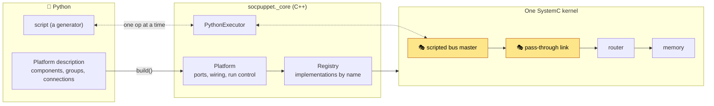
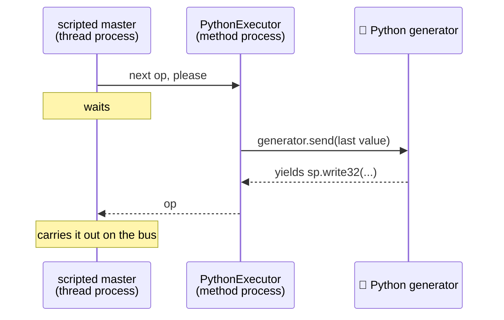

# How socpuppet is put together 🧦

socpuppet simulates a system-on-chip in [SystemC](https://systemc.org) and lets you compose and drive it from Python. This page explains the parts, the words used for them, and why they are shaped the way they are.

As of milestone M0 there are no CPUs yet. What exists is the stage and the first stand-ins: enough to describe a small platform, run it and watch what crosses its buses.

## The picture



The yellow blocks are 🎭 stand-ins. A stand-in holds a block's place on stage so that the rest of the cast can rehearse: it has the same connections as the real thing and does a simplified version of its job.

## Words you will meet

| Term | Meaning |
|---|---|
| **TLM** | Transaction-level modeling. Blocks talk by handing each other whole transactions ("write these 4 bytes at this address") through function calls, instead of wiggling individual wires. It is what makes a virtual platform fast enough to boot software. socpuppet uses the TLM-2.0 standard that ships with SystemC. |
| **Initiator / target** | The block that starts a transaction (a CPU) and the block that answers it (a memory). Their connection points are *sockets*. |
| **Loosely timed (LT)** | The TLM style socpuppet uses: one function call per transaction, with timing noted as an annotation instead of simulated cycle by cycle. |
| **DMI** | Direct memory interface. A memory can hand an initiator a raw pointer to its bytes, so later accesses skip the bus altogether. It is the main reason a CPU model can run fast. |
| **Debug transport** | A way to read or write through the bus that takes no simulated time and that nothing in the platform notices, the way a debugger reads memory. `peek` and `poke` use it. |
| **Elaboration** | SystemC's construction phase: modules are created and bound, then the structure is frozen. Nothing can be added once simulation starts. |
| **Delta cycle** | One round of "run everything that is ready, then apply updates" at a single moment of simulated time. Many deltas can happen without time moving. |
| **Devicetree** | A description of hardware (what exists, at which address) that firmware such as Zephyr is built against. |

## Layers

```text
python/socpuppet/         🧵 what you import: describe, build, run, inspect
src/socpuppet/bindings/   the pybind11 extension, and the bridge back into Python
src/socpuppet/platform/   composing by name: ports, registry, Platform, tracer, slots
src/socpuppet/models/     the SystemC blocks
src/socpuppet/core/       plain C++ with no simulator: bytes, scripts, trace records
```

Each layer only knows about the ones below it. `core/` has no SystemC in it at all, so its logic is tested without a kernel.

## Describe, build, run

```python
import socpuppet as sp

platform = sp.Platform()
compute, io = platform.group("compute"), platform.group("io")
cpu = compute.add("cpu", sp.ScriptedBusMaster(script))
d2d = platform.link("d2d", sp.PassThroughLink(), compute, io)
bus = io.add("bus", sp.Router())
ram = io.add("ram", sp.Memory(size=64 * 1024))
platform.connect(cpu.socket, d2d.a.target, trace=True)
platform.connect(d2d.b.initiator, bus.target)
bus.map(ram.socket, base=0x8000_0000)

platform.build()
platform.run()
```

There are three phases, and the order matters.

1. **Describe.** `add`, `group`, `link`, `connect` and `map` only record what you want. This is pure Python: the simulator is not even loaded. That is what lets `socpuppet devicetree my_platform.py` produce a devicetree without simulating anything, from the same description that builds the simulation.
2. **Build.** `build()` loads the simulator, creates each component through the C++ registry, binds the ports and completes SystemC's elaboration. From here on the topology is fixed, and memory can already be peeked and poked.
3. **Run.** `run()`, `run(duration)`, `step()` and `run_until(condition)` advance simulated time.

💡 The Python classes (`sp.Memory`, `sp.Router`, ...) are a catalogue that mirrors the C++ registry. They exist separately so that describing works without the simulator. A test keeps the two in step.

### Names

Names are dotted paths. `io.ram` is the component `ram` in the group `io`, and a group is typically a die. The same path names the component in SystemC, in traces, in error messages and (as `io_ram`) in the devicetree.

### Ports

A component offers named ports, and `connect` joins a *source* to a *sink*:

| Kind | Source | Sink | Carries |
|---|---|---|---|
| bus | TLM initiator socket | TLM target socket | memory-mapped transactions |
| wire | driver | reader | one boolean line: an interrupt, a reset |

Mixing kinds, or connecting two sources, is refused with a message naming both ports. A wire input left unconnected is tied low. A link direction nobody uses is tied off.

## ⚠️ One platform per process

The SystemC kernel is a process-wide singleton and cannot be restarted. After a run it is not resting, it is an ex-kernel. So a process can build exactly one `Platform`, and a second attempt is refused with an explanation.

For tests, each one that builds a platform gets its own process:

- **C++**: `gtest_discover_tests` registers every test with CTest separately, and CTest runs each in a fresh process.
- **Python**: mark the test `@pytest.mark.platform`. The plugin `socpuppet.pytest_plugin` re-runs it in a fresh interpreter and relays the result.

## How Python gets called from inside the simulation

A Python script drives a stand-in CPU one bus operation at a time. That means the running simulation has to call back into Python, and there is a catch.

A SystemC *thread process* runs on a small private stack of its own. CPython assumes it is running on the operating system thread's real stack: it measures that stack to catch runaway recursion, and debuggers walk it. Calling Python from a thread process breaks those assumptions. Python 3.14 began checking the stack's bounds, and on a stack it does not know about that check can report an overflow that is not there.

A *method process* is different. The kernel calls it directly, on the stack of whoever called `sc_start()`, which is Python's own.



So the rule is: **Python only ever runs on the kernel's main stack.** The master hands the job to the `PythonExecutor` and waits. The hand-over uses immediate notifications, so it costs no simulated time and no delta cycle. As a bonus, tracebacks, `pdb` and Ctrl-C all work normally.

## When something goes wrong

An exception must not escape a SystemC process: the kernel would flatten it into a generic report and refuse to run again. So a failing model *parks* its exception and pauses the kernel, and `run()` raises it once the kernel has handed control back.

The result is that a failed `expect32`, or an exception raised in your script, comes out of `platform.run()` unchanged, with its traceback, and the platform can still be inspected afterwards.

## Stand-ins and contracts

Every block in the final platform has a *slot*: a place that a stand-in fills first and the full model fills later. Two things keep the swap honest.

- **Slot concepts** (`src/socpuppet/platform/slots.h`) say what shape an implementation must have, checked by the compiler.
- **Contract suites** (`tests/cpp/contracts/`) say how it must behave. Each is one set of tests that every implementation of the slot has to pass.

| Slot | Contract | Implementations in M0 |
|---|---|---|
| memory | `MemoryContract` | `Memory` |
| link endpoint | `LinkContract` | 🎭 `PassThroughLinkEndpoint` |

When the real die-to-die link arrives it passes `LinkContract` too, and the platform around it does not change.

## The models

Each has a page saying what real hardware it stands for and what it leaves out.

- [Machine timer](models/machine-timer.md)
- [Memory](models/memory.md)
- [Router](models/router.md)
- [UART (16550)](models/ns16550.md)
- 🎭 [Pass-through link](models/pass-through-link.md)
- 🎭 [Scripted bus master](models/scripted-bus-master.md)
- [Tracer](models/tracer.md)

## What is in the box, and where it came from

| Piece | Source |
|---|---|
| Simulation kernel, TLM-2.0 | [SystemC 3.0](https://github.com/accellera-official/systemc) (Accellera) |
| Router, logging | [SystemC-Components](https://github.com/Minres/SystemC-Components) (SCC, Minres) |
| Python bindings | [pybind11](https://github.com/pybind/pybind11) |
| Everything else | this repo |

All of it is built from source as static libraries and linked into the one Python extension, so installing the package needs nothing else. See [development.md](development.md) for building it yourself.

🚧 Not built yet: CPUs, PCIe, NVMe, the real die-to-die link, Zephyr boards. See [plan.md](plan.md).
