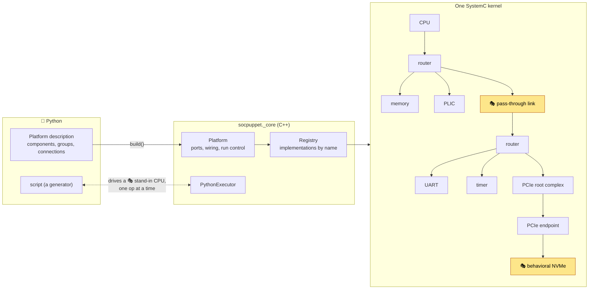
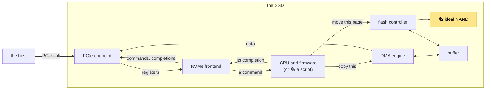
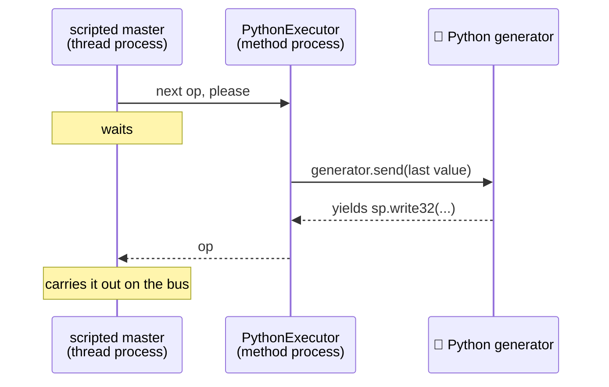

# How socpuppet is put together 🧦

socpuppet simulates a system-on-chip in [SystemC](https://systemc.org) and lets you compose and drive it from Python. This page explains the parts, the words used for them, and why they are shaped the way they are.

As of milestone M3 there is a real CPU on stage, with a UART, a timer and an interrupt controller around it, which is enough to boot Zephyr on one board, the host. There is PCIe too, with a 🎭 stand-in NVMe drive behind it. A Python host can read and write that drive, and so can Zephyr on the host board, with its own NVMe driver. Since M4 there is also an SSD built the way a real one is, of hardware that keeps the queues and moves the data, with a CPU of its own. That CPU runs the SSD's firmware, a Zephyr application, and 🎭 a script can play the firmware where a CPU is not wanted. Since M5 the die-to-die link between the host's two dies is real as well, in the style of UCIe: it has to be trained before it carries anything, and the IO die has a manager with a CPU of its own whose firmware, a third Zephyr application, trains it and lets the compute die out of reset, which is how a chiplet starts. The host and the SSD have each booted with a stand-in for the other, and have yet to meet. The rest of the cast is still stand-ins or not yet written.

## The picture



This is the host board, with the drive that M2's tests plug into its IO die. The SSD that takes the stand-in drive's place has a picture of its own, below. The CPU runs real firmware. A script can take its place: the 🎭 scripted bus master, a stand-in that plays bus operations from a Python generator instead of executing instructions.

The yellow blocks are 🎭 stand-ins. A stand-in holds a block's place on stage so that the rest of the cast can rehearse: it has the same connections as the real thing and does a simplified version of its job.

## The SSD



🎓 A real SSD's controller is built this way round: hardware for what is the same every time, and firmware for what takes judgement. The [NVMe frontend](models/nvme-frontend.md) keeps the queues, fetches each command and posts its completion. The firmware reads the command and decides. The [DMA engine](models/dma-engine.md) copies a command's data between the host's memory and the SSD's buffer, and the [flash controller](models/flash-controller.md) moves pages between the buffer and the NAND. The host sees none of it: behind the endpoint is an NVMe drive, as the stand-in drive is.

`socpuppet.boards.ssd` describes it. `examples/ssd_hello.py` runs it with 🎭 a script for its firmware, and `examples/ssd_firmware_hello.py` with the real thing, the Zephyr application in `firmware/ssd`. [The firmware's page](models/ssd-firmware.md) is about both.

## Words you will meet

| Term | Meaning |
|---|---|
| **TLM** | Transaction-level modeling. Blocks talk by handing each other whole transactions ("write these 4 bytes at this address") through function calls, instead of wiggling individual wires. It is what makes a virtual platform fast enough to boot software. socpuppet uses the TLM-2.0 standard that ships with SystemC. |
| **Initiator / target** | The block that starts a transaction (a CPU) and the block that answers it (a memory). Their connection points are *sockets*. |
| **Loosely timed (LT)** | The TLM style socpuppet uses: one function call per transaction, with timing noted as an annotation instead of simulated cycle by cycle. |
| **DMI** | Direct memory interface. A memory can hand an initiator a raw pointer to its bytes, so later accesses skip the bus altogether. It is the main reason a CPU model can run fast. |
| **ISS** | Instruction-set simulator: a model of a processor that executes the firmware's instructions one after another. socpuppet's is DBT-RISE-RISCV. |
| **Temporal decoupling, quantum** | A CPU model runs many instructions in one go, ahead of simulated time, and only then lets the rest of the platform catch up. The quantum is how far ahead it may get. Longer is faster, and shorter means an interrupt is seen sooner. |
| **Debug transport** | A way to read or write through the bus that takes no simulated time and that nothing in the platform notices, the way a debugger reads memory. `peek` and `poke` use it. |
| **Elaboration** | SystemC's construction phase: modules are created and bound, then the structure is frozen. Nothing can be added once simulation starts. |
| **Delta cycle** | One round of "run everything that is ready, then apply updates" at a single moment of simulated time. Many deltas can happen without time moving. |
| **ELF** | The file format a linker produces: the program's bytes in segments, each with the address it belongs at. `load_elf` puts one into memory. |
| **Devicetree** | A description of hardware (what exists, at which address) that firmware such as Zephyr is built against. |

## Layers

```text
python/socpuppet/         🧵 what you import: describe, build, run, inspect
src/socpuppet/bindings/   the pybind11 extension, and the bridge back into Python
src/socpuppet/platform/   composing by name: ports, registry, Platform, tracer, slots
src/socpuppet/models/     the SystemC blocks
src/socpuppet/core/       plain C++ with no simulator: bytes, scripts, trace records
regs/                     the register maps of our own blocks, which every layer's numbers come from
```

Each layer only knows about the ones below it. `core/` has no SystemC in it at all, so its logic is tested without a kernel. `regs/` is beside the layers and not one of them: [what is generated from it](#where-the-hardwaresoftware-interface-is-written-down) is what the C++, the Zephyr drivers and the Python all read.

## Describe, build, run

```python
import socpuppet as sp

platform = sp.Platform()
compute, io = platform.group("compute"), platform.group("io")
cpu = compute.add("cpu", sp.ScriptedBusMaster(script))
d2d = platform.link("d2d", sp.PassThroughLink(), compute, io)
bus = io.add("bus", sp.Router())
ram = io.add("ram", sp.Memory(size=64 * 1024))
platform.connect(cpu.socket, d2d.a.target, trace=True)
platform.connect(d2d.b.initiator, bus.target)
bus.map(ram.socket, base=0x8000_0000)

platform.build()
platform.run()
```

There are three phases, and the order matters.

1. **Describe.** `add`, `group`, `link`, `connect` and `map` only record what you want. This is pure Python: the simulator is not even loaded. That is what lets `socpuppet devicetree my_platform.py` produce a devicetree without simulating anything, from the same description that builds the simulation.
2. **Build.** `build()` loads the simulator, creates each component through the C++ registry, binds the ports and completes SystemC's elaboration. From here on the topology is fixed, and memory can already be peeked and poked.
3. **Run.** `run()`, `run(duration)`, `step()` and `run_until(condition)` advance simulated time.

💡 The Python classes (`sp.Memory`, `sp.Router`, ...) are a catalogue that mirrors the C++ registry. They exist separately so that describing works without the simulator. A catalogue class declares its parameters as annotated attributes and its ports with their kind and direction, so a misspelled keyword is refused when the component is created and a wire connected to a bus when `connect()` is called, both before there is a simulator. A test keeps the two in step: every class's ports, kinds and parameters against what the registry creates.

### Names

Names are dotted paths. `io.ram` is the component `ram` in the group `io`, and a group is typically a die. The same path names the component in SystemC, in traces, in error messages and (as `io_ram`) in the devicetree.

### Ports

A component offers named ports, and `connect` joins a *source* to a *sink*:

| Kind | Source | Sink | Carries |
|---|---|---|---|
| bus | TLM initiator socket | TLM target socket | memory-mapped transactions |
| wire | driver | reader | one boolean line: an interrupt, a reset |

Mixing kinds, or connecting two sources, is refused with a message naming both ports. A wire has one driver: a component whose line can change for more than one reason (a register write, its own timer) still writes it from one process of its own, and SystemC refuses a second one by name. A wire input left unconnected is tied low. A wire output that a component marks as optional may be left unconnected too: an interrupt line of the NVMe stand-in that the host does not use, for example. A link direction nobody uses is tied off.

## ⚠️ One platform per process

The SystemC kernel is a process-wide singleton and cannot be restarted. After a run it is not resting, it is an ex-kernel. So a process can build exactly one `Platform`, and a second attempt is refused with an explanation. ⚠️ A `build()` that fails part-way counts: SystemC keeps the processes of the modules it had created, and they cannot be taken out again. So a description is checked in Python as far as it can be before the simulator is created, and after a failed `build()` the fix is run in a new process.

For tests, each one that builds a platform gets its own process:

- **C++**: `gtest_discover_tests` registers every test with CTest separately, and CTest runs each in a fresh process.
- **Python**: mark the test `@pytest.mark.platform`. The plugin `socpuppet.pytest_plugin` re-runs it in a fresh interpreter and relays the result. pytest finds the plugin by itself wherever socpuppet is installed. A marked test that runs for longer than `socpuppet_platform_timeout` seconds (300 unless you set it in pytest's configuration) is stopped and fails, so a script that loops for ever cannot hold up the whole run.

## How Python gets called from inside the simulation

A Python script drives a stand-in CPU one bus operation at a time. That means the running simulation has to call back into Python, and there is a catch.

A SystemC *thread process* runs on a small private stack of its own. CPython assumes it is running on the operating system thread's real stack: it measures that stack to catch runaway recursion, and debuggers walk it. Calling Python from a thread process breaks those assumptions. Python 3.14 began checking the stack's bounds, and on a stack it does not know about that check can report an overflow that is not there.

A *method process* is different. The kernel calls it directly, on the stack of whoever called `sc_start()`, which is Python's own.



So the rule is: **Python only ever runs on the kernel's main stack.** The master hands the job to the `PythonExecutor` and waits. The hand-over uses immediate notifications, so it costs no simulated time and no delta cycle. As a bonus, tracebacks, `pdb` and Ctrl-C all work normally.

## When something goes wrong

An exception must not escape a SystemC process: the kernel would flatten it into a generic report and refuse to run again. So a failing model *parks* its exception and pauses the kernel, and `run()` raises it once the kernel has handed control back.

The result is that a failed `expect32`, or an exception raised in your script, comes out of `platform.run()` unchanged, with its traceback, and the platform can still be inspected afterwards.

## The IO manager

The host is two dies, and the link between them is not there when the power comes on. Something has to train it, and that something cannot be the compute die, whose CPU is held in reset until the link is up. So the IO die has a manager: a small CPU whose firmware trains the link, then lets the other die go by writing to a register at the far end of it, over the link's sideband.

```text
 compute die (🎭 a stand-in)          IO die
 🎭 master ─▶ bus ─┬─▶ d2d.a ═══ d2d.b ─▶ bus ─┬─▶ scratch
                   └─▶ ram         ▲           └─▶ the link's registers
                    reset ◀────────┘                 ▲
                                        🎭 the manager ┘
```

`socpuppet.boards.io_manager` describes it, with 🎭 a script standing in for the whole compute die. The manager's CPU runs `firmware/iomgr`, a Zephyr application, on the board `socpuppet_iomgr`; or 🎭 [a script plays the manager](models/io-manager.md) where a CPU is not wanted. `examples/io_manager_hello.py` runs it that way and prints [the link's](models/d2d-link.md) bring-up, packet by packet, out of the trace. 🚧 M7 puts the real host on the other die.

## Where the hardware/software interface is written down

🎓 Firmware and the hardware it runs on have to agree about a handful of numbers: which address a device answers at, which interrupt line is whose, where each register is in a device's block, and which bit of it means what. Together they are the *hardware/software interface*. A real chip project writes each of them down once and generates everything else, because two copies of a number are a bug that has not happened yet. socpuppet does the same, in two places, one for each kind of number.

| What | Where it is written, once | What is made from it |
|---|---|---|
| Which device is at which address, on whose bus, through which window | A board's Python description: each `bus.map(...)` | The devicetree firmware is built against, `Platform.address_map()`, `socpuppet address-map`, and the tables in [address-map.md](address-map.md) |
| Which interrupt line is which number | The same description: each `platform.connect(device.irq, plic.source3)` | The devicetree's `interrupts-extended`, `Platform.interrupt_map()`, and the same command and page |
| Where a block's registers are, what their bits mean, what they can be told and what they hold at reset | The block's register map, `regs/<block>.rdl` | A C header that the model and its Zephyr driver both include, a Python module for the stand-ins and the boards, and the table on the block's page |

```text
                                      ┌─▶ regs/dma_engine.h ──┬─▶ the model       (C++)
 regs/dma_engine.rdl ─▶ tools/regs.py ┤                       └─▶ the driver      (Zephyr's C)
                                      ├─▶ regs/dma_engine.py ───▶ 🎭 the stand-in, the board (Python)
                                      └─▶ the table in docs/models/dma-engine.md
```

- 🎓 **A register map is written in SystemRDL**, the language the industry writes them in. `regs/` has a file for each block that is socpuppet's own design: the [command device](models/command-device.md), the [DMA engine](models/dma-engine.md), the [flash controller](models/flash-controller.md), the CPU's side of the [NVMe frontend](models/nvme-frontend.md) and the [die-to-die link](models/d2d-link.md). A borrowed model (the UART, the timer, the PLIC) has its registers from its own project, and what a specification lays out (an NVMe controller's registers, PCIe's configuration space) is the specification's to describe.
- **What is generated is checked in**, so the simulator builds with nothing but a compiler and the wheel needs no register compiler. Lint holds every generated file to its source: `uv run python tools/lint.py` fails if a header, a module or a table is not what its map gives, and `--fix` writes it again. The tables in address-map.md are held to the boards the same way.
- 💡 **To move a register, change one line** of its `.rdl` and run `uv run python tools/lint.py --fix`. The model, the driver, the stand-ins, the tests and the docs all follow, and the firmware does when it is next built.
- **A register that two blocks share is at the same place in both.** The DMA engine and the flash controller begin with the command device's three registers, by its types, and `tools/regs.py` refuses a map that puts one of them anywhere else. That is what lets one piece of a driver serve both.
- **There is no file above the boards.** An address is written once, in the board's own file in `python/socpuppet/boards/`, and the Python description is the one place a platform is put together. What the maps add is a way to see the result without reading a devicetree.
- ⚠️ **What is still written by hand**: the drawings and the prose, the gaps a register map leaves reserved, which a test of each block names, and the layout of a sideband packet, which C++ and Python each have a copy of.

## Stand-ins and contracts

Every block in the final platform has a *slot*: a place that a stand-in fills first and the full model fills later. Two things keep the swap honest.

- **Slot concepts** (`src/socpuppet/platform/slots.h`) say what shape an implementation must have, checked by the compiler.
- **Contract suites** (`tests/cpp/contracts/`) say how it must behave. Each is one set of tests that every implementation of the slot has to pass.

| Slot | Contract | Implementations |
|---|---|---|
| memory | `MemoryContract` | `Memory` |
| link endpoint | `LinkContract` | `D2dLinkEndpoint`, 🎭 `PassThroughLinkEndpoint` |
| CPU | `BusMasterContract` | `DbtRiseCpu`, 🎭 `ScriptedBusMaster` |
| UART | `UartContract` | `Ns16550` |
| machine timer | `MachineTimerContract` | `MachineTimer` |
| interrupt controller | `InterruptControllerContract` | `Plic` |
| NVMe function | `NvmeContract` | 🎭 `BehavioralNvme`, and the SSD's hardware (`NvmeFrontend`, `DmaEngine`, `FlashController`, a NAND) with 🎭 firmware. The Zephyr firmware is held to its share of the contract by `tests/python/test_ssd_firmware.py` |
| NAND flash chip | `NandContract` | 🎭 `IdealNand` |

The real die-to-die link passes `LinkContract` beside the stand-in, and the platform around it does not change. What does change is that the real one has to be trained first, so the contract's rigs say how: the stand-in's does nothing, and the real one's writes to the link's registers and waits.

### Borrowed models

💡 socpuppet borrows before it builds. The CPU, the UART, the timer and the interrupt controller are other projects' models, each behind a small adapter of ours. A contract suite does a second job for a borrowed model: it is written first, it says what socpuppet relies on, and it found real bugs in every model it was pointed at. Those are fixed with small patches, and each patch is written up in [upstream.md](upstream.md), ready to send back.

## The models

Each has a page saying what real hardware it stands for and what it leaves out.

- [Command device](models/command-device.md), which is what the DMA engine and the flash controller share
- [CPU (DBT-RISE-RISCV)](models/dbt-rise-cpu.md)
- [Die-to-die link](models/d2d-link.md)
- [DMA engine](models/dma-engine.md)
- [Flash controller](models/flash-controller.md)
- [Interrupt controller (PLIC)](models/plic.md)
- [Machine timer](models/machine-timer.md)
- [Memory](models/memory.md)
- [MSI-to-PLIC bridge](models/msi-plic-bridge.md)
- [NVMe frontend](models/nvme-frontend.md)
- [PCIe endpoint](models/pcie-endpoint.md)
- [PCIe root complex](models/pcie-root-complex.md)
- [Router](models/router.md)
- [UART (16550)](models/ns16550.md)
- 🎭 [Behavioral NVMe](models/behavioral-nvme.md)
- 🎭 [Ideal NAND](models/ideal-nand.md)
- 🎭 [IO-die manager](models/io-manager.md)
- 🎭 [MSI receiver](models/msi-receiver.md)
- 🎭 [NVMe host driver](models/nvme-host.md)
- 🎭 [PCIe host](models/pcie-host.md)
- 🎭 [Pass-through link](models/pass-through-link.md)
- 🎭 [Scripted bus master](models/scripted-bus-master.md)
- 🎭 [SSD firmware](models/ssd-firmware.md)
- [Tracer](models/tracer.md)

## What is in the box, and where it came from

| Piece | Source |
|---|---|
| Simulation kernel, TLM-2.0 | [SystemC 3.0](https://github.com/accellera-official/systemc) (Accellera) |
| Router, logging | [SystemC-Components](https://github.com/Minres/SystemC-Components) (SCC, Minres) |
| CPU | [DBT-RISE-RISCV](https://github.com/Minres/DBT-RISE-RISCV) (Minres) |
| UART, machine timer, interrupt controller | [VPV-Peripherals](https://github.com/VP-Vibes/VPV-Peripherals) (TU Munich, Minres) |
| Reading ELF files | [ELFIO](https://github.com/serge1/ELFIO) |
| The layouts of NVMe's registers and commands | [SPDK](https://github.com/spdk/spdk) (one header) |
| Python bindings | [pybind11](https://github.com/pybind/pybind11) |
| Everything else | this repo |

All of it is built from source as static libraries and linked into the one Python extension, so installing the package needs nothing else. See [development.md](development.md) for building it yourself.

To run firmware of your own, see [boot-your-firmware.md](boot-your-firmware.md).

🚧 Not built yet: the host and the SSD in one simulation with their own firmware on both, and the real host on the far side of the real die-to-die link. See [plan.md](plan.md).
